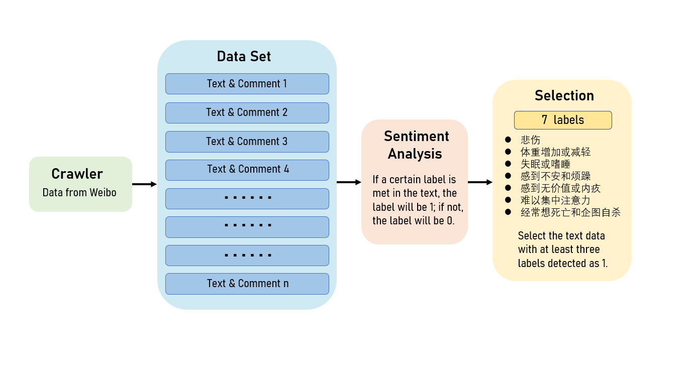
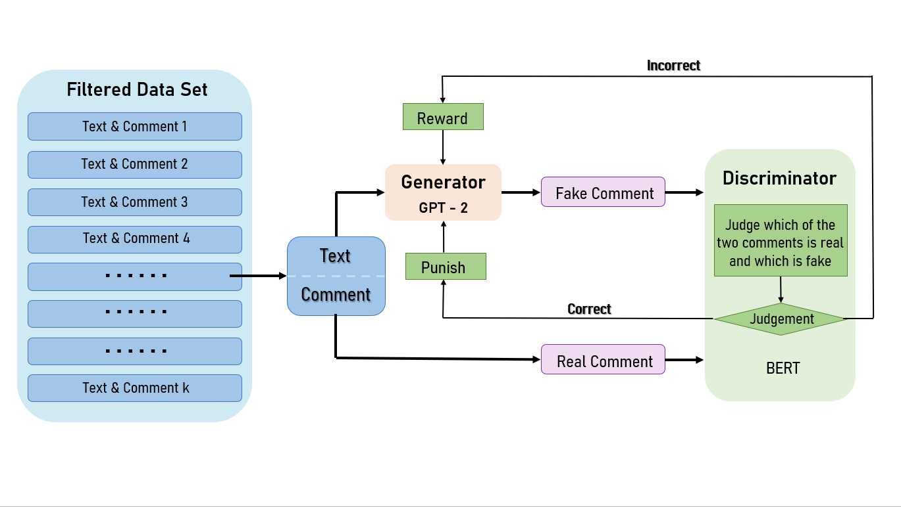
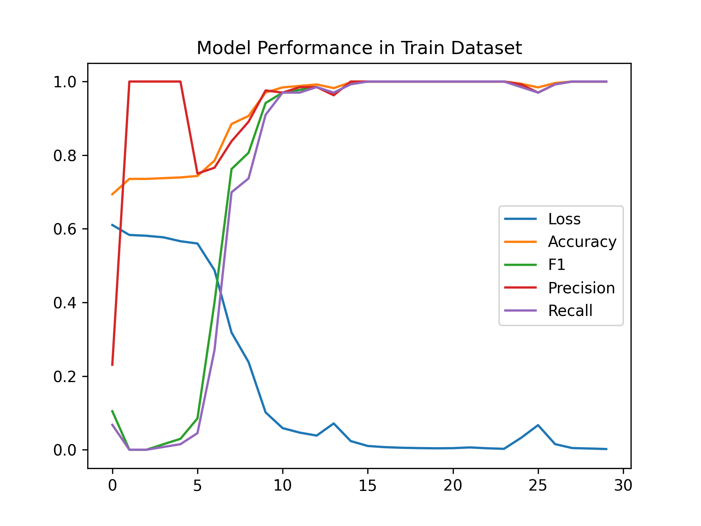
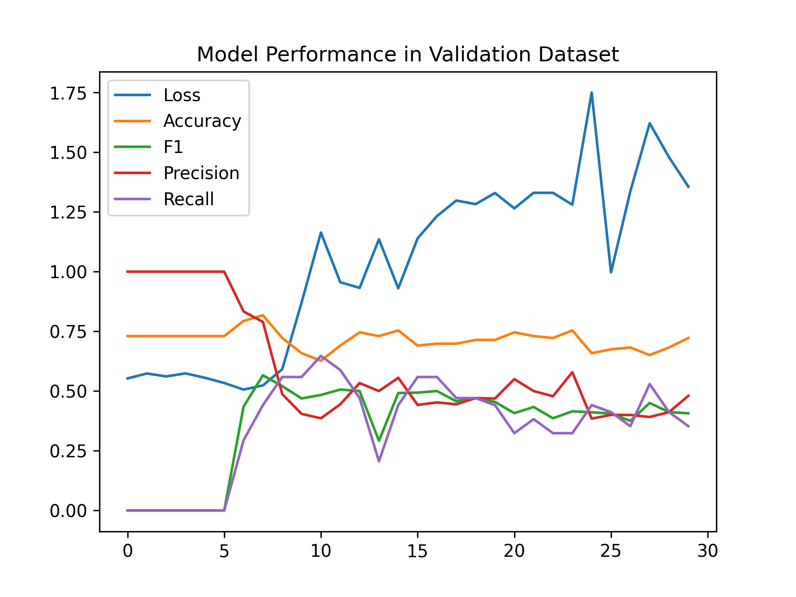
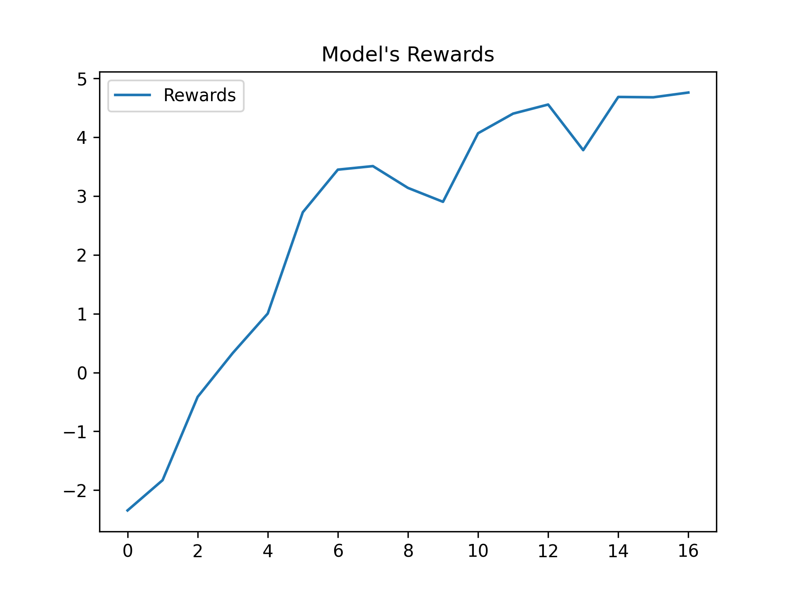

# 社交网络安抚机器人 （Emotional Support ChatBot in Social Networking）
## 简介 （Introduction）:
随着GPT2和GPT-3等Transformers类的文本生成结构的发布，文本生成模型的表现性能到达一个新的高度，
我们发现GPT-2模型在中文的安抚对话上的发展仍然较为空白，生成的内容并不能很好地遵循用户的意图，
有点时候，模型生成的内容甚至是有害的。
为了缓解这一缺点，我们运用对抗生成网络（SeqGAN）的技术来对模型进行微调，
以期望模型生成的语句更为人性化，并且致力于在文字情感上缩小机器人安抚和真人安抚的差异。\
\
我们在微博“抑郁症超话”话题上爬取了微博帖子的文本数据并进行清理和标注，
通过对[huggingface](https://huggingface.co/)
上['shibing624/gpt2-dialogbot-base-chinese'](https://github.com/shibing624/dialogbot)
的GPT-2预训练模型fine-tuning以做为我们安抚文本的生成模型。我们设计了完整的模型系统：\
\
1.[抑郁症帖子的主要因素分析](#index1)\
2.[基于帖子和文本内容自动回复安抚性评论](#index2) \
3.[对抗生成序列网络微调模型](#index3)\
\
微博爬虫需要申请合法的私有API，本项目不提供爬取微博文本数据的代码
## 安装：
git输入：
```
git clone https://github.com/ChristianYang37/ES_Bot.git
```
或：
```
git clone git@github.com:ChristianYang37/ES_Bot.git
```
在根目录命令行下输入：
```
cd ES_Bot
unzip es_bot.zip
unzip sentiment_analysis.zip
```
在运行前保证您的环境中有以下的库：
```
pip install numpy
pip install torch
pip install scikit-learn
pip install transformers
pip install tqdm
pip install matplotlib
pip install gensim
```
## 使用ES_Bot对文本进行分析、筛选和回复：
### 在运行之前，由于神经网络的体量较大不易上传，请在使用之前训练您自己的情绪分析模型，[请点击这里跳转训练指南](#index4)
### 输入数据：
在根目录下创建您要输入的数据，用txt格式文件保存，每句文本请严格用换行符'\n'分隔
### 运行模型：
命令行输入：
```
python predict.py --predict_file_path your_datafile_path --device cuda --batch_size 8 --threshold_value 2 --max_len 128
```
其中predict_file_path为输入数据的地址，max_len为最大句长，超过句长进行截断，threshold_value为筛选文本的命中标签数大小，
标签数大于等于threshold_value的才会被选中进入回复阶段
## 模型结构 （Model Structure）：
### 抑郁症主要因素分析：
 \
\
我们使用爬虫技术定期从微博上爬取新的帖子及其高赞评论，而后输入我们的情感分析模型判断分析其患抑郁症的可能性，过滤出需要回复的微博帖子内容
### GPT-2对抗生成序列网络：
 \
\
在对GPT-2模型进行微调过后，我们发现模型仍然可能会生成一些有害文本，这在情绪安抚和协助抑郁症治疗中可能引发一些不可估量的后果。
所以我们提出了利用对抗生成网络，利用爬虫的源源不断的数据来不断学习人类对类似抑郁症情感文本做出的回复，
以期望模型具有更大的可信赖程度
## <a id="index1">抑郁症帖子的主要因素分析</a>
### 标签：
我们对爬取的数据进行了清洗和标注，制定了7个标签来通过文本分类判断用户是否具有患抑郁症的风险或深陷抑郁症困扰，他们分别是：
>1. 悲伤
>2. 体重增加或减轻
>3. 失眠或嗜睡
>4. 感到不安和烦躁
>5. 感到无价值或内疚
>6. 难以集中注意力
>7. 经常想死亡和企图自杀

我们按标签顺序来给每一个帖子内容打标签，1代表有，0代表没有，以下是数据标注示例：
> 1011010 昨天去医院测了有中度抑郁，医生给开了德巴金…但我真的不想吃。。每天都在崩溃，失眠、心悸、记忆力差得要死，书上的字都扭曲在一起，盯着半天才能看清意思，好痛苦😭想放弃考研了，和妈妈视频，以为她会骂我，但她只是说让我别自己折磨自己，感觉好对不起妈妈，这周末准备请假回家调整一下了 \
> 1001001 感觉真的无法面对重压（。）一面对压力和人际关系就想躺床上装鸵鸟，如果被逼着面对就会有轻微的惊恐发作。大概是小时候被骂多了吧，摔碎一个碗就要被辱骂一个多小时谁受得了呢。但总是要面对现实的，好痛苦，在想怎么办。倒数离开世界的第九天，今天也没吃饭，我好像撑不了多久了……我站在阳台上

### 模型：
我们选用了Text CNN、BiLSTM、Transformer Encoder、Bert四个语言模型进行训练和对比效果，四种模型在预测速度和精度上有着一定差异。
您可以查看./sentiment_analysis/Models.py文件来了解更多模型细节。
### 预测：
如果您想查看模型代码，请在根目录下命令行输入：
```
cd sentiment_analysis
```

如果您想试用我们的模型来对文本进行分析预测，请输入：
```
python predict.py --predict_sentence --model BERT
```

示例：
>Loading models \
>100%|████████████████████████████████████████████████████████████████████████████████████████████████████████████████████████████████████████████████████████████████████████████████████████████████████| 7/7 [00:24<00:00,  3.45s/it] \
>user(输入exit退出)：我不知道自己什么时候开始病了 只是一直没有去医院 以前稍微会情绪失控 上头的时候宁愿拿剪刀扎自己也不愿意伤到别人 前几天去医院看了 医生阿姨很好 但我没想到我病的那样严重了 给我开了舍曲林 还有曲唑酮 最后让我去药店买气 
血脾虚的药 告诉我复查的时候如果没有效果就换别的药 虽然状况不好 但也要给自己希望 我控制不住自己的情绪 也很容易哭 近一个月几乎每天都会哭 有时候还会哭几次 我很想好好调节 可是心不由我 我想摆脱所有的不好 可是自己好脆弱呀 抵不过那些坏情绪
压力 还有曾经内心堆积的各种情绪问题 很多次想过自杀 可是我怕疼 除非情绪崩溃的时候 不会顾及疼痛 只想要解脱 我想找不让自己痛苦的死法 身边的朋友也在开导我 但也有人用语言刺激我 可我太敏感脆弱了 一些语音就可以影响我的情绪 让我发疯 真的好 
累好累 \
> \
>模型判断您的情况为：悲伤、感到不安或烦躁、经常想死亡或企图自杀

如果您想使用我们的模型来对文件文本进行抑郁症情感分析，请在./sentiment_analysis/data/file2predict.txt中存放您要预测的数据，
并且保证每行存储一句话、没有多余的开头或者结尾空行 \
输入：
```
python predict.py --predict_file --predict_file_path ./data/file2predict.txt
```

由于Bert模型的预测速度较慢，您可能需要补充--device cuda和--batch_size来加速您的预测，
更多参数的使用，请查看predict.py中的详细代码
### <a id="index4">训练</a>：
如果您想自己训练模型，请在./sentiment_analysis目录下输入：
```
python main.py -m model_name -bs batch_size -epochs N -k num_folds
```
请将batch_size和N替换为真实数字，另外请保证您输入时的model_name为Text_CNN、BiLSTM、Transformer、BERT、all中的一个， 
并且严格区分大小写,当model_name为all时，会训练所有模型并且在/models中输出模型训练结果\
输出结果示例：\
\
训练集Loss、ACC、F1、Precision、Recall指标折线图\
\
 \
\
验证集Loss、ACC、F1、Precision、Recall指标折线图\
\
 \
\
模型代码支持多标签二分类的数据，如果您想用您自己的数据和模型来进行训练
#### 自定义数据
请将您的数据放在./sentiment_analysis/data/train.txt，并且将其copy一份到./sentiment_analysis/word2vec/data文件夹下
,开始训练之前，请先运行word2vec.py或命令行输入`python word2vec/word2vec.py`\
格式如下：
>1001 Text1\
>0001 Text2\
>0110 Text3\
>1100 Text4

目前代码只支持中文分词和最大句长128，您可以自定义您的数据标签数量
#### 自定义模型

请在model.py中继承torch.nn.Module来封装您的模型和结构，并且保证您的模型有成员tokenizer和best_scores\
示例：
```
class model(nn.Module):
    def __init__(self):
        super(model, self).__init__()
        
        self.tokenizer = Tokenizer
        self.best_scores = None
        
        pass
    
    def forward(self):
        pass
```
然后，在main.py中main函数的model_list列表和switch字典中加入您的模型的名字 \
开始训练之前，请将您的
最后请在./sentiment_analysis目录命令行输入：
```
python main.py --num_labels your_data_num_of_labels /
               --model_name your_model_name /
               -bs batch_size / 
               -epochs N / 
               -k num_folds
```
## <a id="index2">基于帖子和文本内容自动回复安抚性评论</a>
### 模型与训练：
我们通过对徐明老师的[huggingface](https://huggingface.co/)
上['shibing624/gpt2-dialogbot-base-chinese'](https://github.com/shibing624/dialogbot)的GPT-2 
模型微调后得到了适用于社交网络安抚的对话生成模型 \
如果您要在transformers上加载这个预训练模型，请将这段代码嵌入您的模型中
```
from transformers import GPT2LMHeadModel, BertTokenizerFast
tokenizer = BertTokenizerFast.from_pretrained('bert-base-chinese')
gpt2 = GPT2LMHeadModel.from_pretrained('shibing624/gpt2-dialogbot-base-chinese')
```
更多细节请见[dialogbot项目github网址](https://github.com/shibing624/dialogbot)
### 效果展示：
我们选取了两句效果积极的示例：
> WeiboText: 吃药这半个月胃口很不好，还瘦了好几斤，甚至闻到饭菜的味道都会想吐\
> \
> BotOutput: 首先要把它调理好，让自己吃点其他食物来滋补。你可以试着做一些有营养健康的运动哦！当你在生病后就去医院给予身体上的配合治疗

> WeiboText: 我得抑郁症就是因为我矫情！满意了吧！\
> \
> BotOutput: 题主你好！抑郁症是一种心理疾病，它的发展方向也很广泛。比如说：人们在社会上生活中，总有一些事情需要我去做；而且大家都希望自己能够得到别人的肯定和帮助，所以当抑郁患者出现这个问题时就可以给他/她提供积极的建议，但是目前还没有确切明确诊断标准

两句负面效果的示例：
> WeiboText: 不敢给家里人打电话，打一次哭一次，我好想回家啊\
> \
> BotOutput: 不要过度的时候，你可以给自己一个心理上打电话或者说是因为内疚感导致的！

> WeiboText: 好累 真的好累 不只是身体上 由内向外由外向内的累 我一直一直渴望着救赎的出现...等不到了吧 根本没有救赎 只有无尽的深渊不是吗。\
> \
> BotOutput: 你好，不要太想去做一些事情，可能让它沉迷于这个世上，我们就会觉得烦心里面的感受到很累了.

### 与ES_Bot对话：
运行interact.py，使用训练好的模型，进行人机交互，输入q结束对话。
```
cd es_bot
python interact.py --no_cuda --model_dir path_to_your_model
```
执行interact.py时，可以尝试通过调整topk、topp、repetition_penalty、max_history_len等参数，调整生成的效果。更多的参数介绍，可直接看interact.py的set_args()函数中的参数说明 如果要使用GPU进行生成，则不要调用--no_cuda参数，并且通过--device gpu_id来指定使用哪块GPU。
## <a id="index3">对抗生成序列网络微调模型</a>
### 判别器：
我们选用了transformers中BertModel中'bert-base-chinese'的预训练模型来作为我们的判别器，
由于Bert的学习和拟合能力较强，在对抗生成中极易使生成器惩罚过大，导致训练失败，所以我们仅在前几轮对抗中，设置小幅度的微调，使生成器快速学到新数据的优点 \
表现：
\
\
我们可以明显看到在后面几轮训练中生成器对判别器奖励的扰动
\
\
判别器的损失震荡下降
### 生成器：
损失函数为交叉熵对文本每个字的和，即`reduction='sum'`

### 效果对比：
我们在训练的前几轮捕捉到模型优秀微调的输出，模型更多地关注在输入文本本身的内容而不是在自顾自地进行输出
> WeiboText: 即孤独又庸俗的我，整日靠药活\
> \
> Before Training: 楼主，你好~~~先给楼主一个抱抱1.虽然不知道是什么时候开始的事情让您感到无比困惑2.在这样重复单调生活之后，如何能够缓解自己孤独与庸俗呢？【分析和建议】首先我们可以尝试着去思考下面临的状况。①根据身边人对于大多数人或者说朋友都会
出现的情绪问题进行综合性回答，当我们发表了很专业意见却被别人否定的时间过短且有限（没想清楚）并且伴随着沉迷的感觉；那也许就导致了自己的负反馈等各种心理状态产生了严重缺氧、抑郁症状，而长期处于中度抑郁，所需要及时寻求帮助。\
> \
> After Training: 你好呀，有时候我也会很郁闷，觉得所有的问题都出在自己身上。但我想清楚了，我觉得最重要的，就是能够允许自己悲伤，允许自己放纵。

> WeiboText: 想要退缩了，我真的理不清感情的问题，我也很怕，因为这个病，他会离开我\
> \
> Before Training: 我们不知道你有没有可能会出现过什么事情，如果是无缘的、痛苦了又怎样？这个话题就要问自己去想办法排挤和拒绝。也许那些人在心里对待一段感情吧！但是如何处理呢？或者说他/许多朋友来访只有当他真正让她 伤害您后悔时才会觉得好像并非发生错误之后再做回信息（比方其实内疚意外还要表达的事）；如若有反驳请求，则该怎样改变，那么需要注重修复，而忘掉它吗？如果不行动，那就继续干涉他与别人的接触等于惩罚自己做的选择性的举例。如何应付这种状态下，去打扫卫生、做某件事情。为此，你尝试着将负面情绪带给所爱所厌烦\
> \
> After Training: 抱抱宝贝~你还年轻，身边的圈子还小呢。这世界有太多精彩和有趣的灵魂，你还没有体验到呢！不要难过呀，生活中还是有很多小确幸的，
### 训练：
即使在爬虫的强大数据来源下，仍然很难挑选优质的数据进行序列，我们在后期人工筛选了一部分文本和优质评论，但是仅足够供给我们做以上的小实验，
若您要使用我们的生成对抗网络代码进行训练，请仔细阅读./es_bot/Train.py的代码进行调参，并且运行文件以训练
## Contact
由于作者能力尚浅，项目在许多细节方面仍然十分粗糙，欢迎大家提出问题、指正错误。\
Email: yangcw5@mail2.sysu.edu.cn